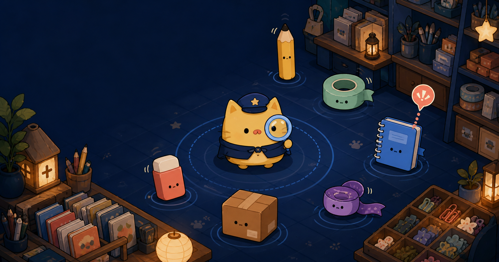

# 눈치숨: 수상한 잡화점



**눈치숨**은 음성 대화 없이 PC와 모바일 웹에서 즐기는 실시간 사물 숨바꼭질 게임입니다. 틈새정령은 연필·노트·테이프 같은 사물로 숨어 진열 미션을 수행하고, 밤지기 관찰자는 배치의 어색함과 움직임 흔적을 살펴 수상한 사물을 찾아냅니다.

## 주요 기능

- 4~10명 공개 빠른 매칭
- 초대 링크 또는 초대 코드를 직접 입력해 참여하는 친구방
- 이용자 1명과 서버 봇 3명이 함께하는 연습방
- 3라운드마다 바뀌는 `밤의 문구점`, `달빛 물류창고`, `별빛 포장공방`
- 이동 공백을 줄인 밀집형 맵, 다양한 구조물과 양방향 문·포탈 이동
- 숨는 이용자는 감춘 채 관찰자만 기준 사물 배치를 미리 탐색하는 기억 단계
- 사물 고정, 자리바꿈, 진열 미션과 관찰 렌즈
- 자유 채팅 없이 사용하는 역할별 무음 팀 핑
- 틈새정령 6.5·관찰자 9.5의 빠른 이동, 약 46% 추격 우위와 30Hz 서버 좌표 화면 보간
- 소개 화면의 귀여운 모루는 보존하고 실제 경기에서는 어두운 망토·균열 가면·발광 눈을 사용하는 밤지기 외형
- 마우스 드래그·휠로 살피는 기준 맵과 무음 마지막 추격 경보
- 역할을 크게 알려주는 10초 역할표, 첫 플레이 말풍선과 마우스·키보드·터치 도움말
- 실제 게임 캡처와 번호 표시로 입장부터 결과까지 설명하는 게임 방법 페이지
- 접속한 PC의 현재 IP·호스트명을 자동으로 따르는 같은 네트워크 공유
- 10초 재접속 유예와 방장 이전

## 패치노트

패치 버전은 공개 게임 기능의 변화 단위를 `0.001`처럼 세 자리 숫자로 기록하고, 날짜는 `연-월-일`에 해당하는 `YYYY-MM-DD` 형식을 사용합니다. 아래 내용은 내부 작업 기록이 아니라 이용자가 체감할 수 있는 변경 사항을 기준으로 정리했습니다.

### 0.009 · 2026-08-21 · 빠른 이동과 위협적인 밤지기

- 틈새정령 이동속도를 5.0에서 6.5, 밤지기 관찰자를 7.8에서 9.5로 높여 두 역할의 이동 공백을 줄였습니다.
- 관찰자의 직선 추격 우위는 약 46%로 유지해 숨는 팀도 포탈과 구조물을 활용해 도망칠 수 있게 했습니다.
- 서버 위치 갱신과 입력 전송을 초당 20회에서 30회로 높이고, 키 입력 시작·해제 즉시 방향을 전달하도록 바꿨습니다.
- 좌표 보간 응답을 빠르게 하고 카메라 추적 지연과 정수 픽셀 반올림을 줄여 이동 화면이 뚝뚝 끊겨 보이는 현상을 완화했습니다.
- 실제 경기의 밤지기에게 어두운 망토, 뿔, 균열 가면, 발광 눈과 아바타별 오라 색을 적용했습니다.
- 기존 귀여운 밤지기 모루 디자인은 입장 전 소개 화면에 원본 모습으로 계속 보존합니다.

### 0.008 · 2026-08-20 · 역할 안내와 인원별 라운드 개선

- 4인 기준 한 라운드를 역할 확인 10초, 숨기·기준 맵 관찰 35초, 수색 125초, 결과 10초의 총 180초로 조정했습니다.
- 참가자가 한 명 늘 때마다 수색 시간이 15초 추가되며, 라운드가 시작된 뒤 인원이 바뀌어도 현재 라운드 시간은 갑자기 변하지 않습니다.
- 역할 확인 전에 서버가 역할을 확정해 본인의 역할·승리 조건·첫 행동 세 가지를 큰 화면으로 보여주고, 다른 참가자의 역할과 위치는 숨깁니다.
- 틈새정령 속도는 5.0으로 유지하고 관찰자만 7.8로 높여 수색 이동 시간을 줄였습니다.
- 세 맵의 면적을 약 9~10% 줄이고 사물 수와 양방향 포탈 2쌍을 유지해 빈 이동 구간을 줄였습니다.
- 포탈 표시에 도착지 이름을 함께 적어 처음 보는 맵에서도 이동 결과를 예상할 수 있게 했습니다.
- 첫 플레이 말풍선, 항상 다시 열 수 있는 역할 도움말과 스킬별 상세 설명을 추가했습니다.
- 스킬 설명은 마우스 올리기, 키보드 포커스와 모바일 터치를 모두 지원합니다.
- 입장부터 결과까지 실제 멀티플레이 화면을 촬영해 번호 표시와 단계별 설명이 있는 게임 방법 페이지를 만들었습니다.

### 0.007 · 2026-08-20 · 유동 네트워크 자동 연결

- Docker 이미지에 `localhost` 게임 서버 주소를 고정하지 않고, 브라우저가 접속한 IP 또는 호스트명을 자동으로 사용하게 했습니다.
- 네트워크가 바뀌어 PC의 사설 IP가 달라져도 Docker 이미지를 다시 만들거나 설정 파일의 IP를 수정할 필요가 없습니다.
- 초대 링크도 방장이 실제로 접속한 주소를 기준으로 만들어 친구가 같은 네트워크에서 그대로 열 수 있습니다.
- 게임 서버는 `same-host` 정책으로 같은 IP·호스트의 웹 Origin을 자동 허용하고, 다른 호스트에서 보낸 요청은 거부합니다.
- 일반 HTTP 사설 IP에서도 방 입장용 ID 생성과 초대 링크 복사가 동작하도록 브라우저 호환 경로를 추가했습니다.
- 외부 도메인이나 별도 게임 서버를 사용할 때는 기존 환경 변수로 명시적 주소를 우선 적용할 수 있습니다.

### 0.006 · 2026-08-20 · 친구방 참가와 추격 템포 개선

- 입장 화면에서 친구가 보낸 초대 코드 또는 전체 초대 링크를 직접 붙여 넣어 방에 참가할 수 있게 했습니다.
- 밤지기 관찰자의 이동속도를 틈새정령보다 30% 빠르게 조정해 추격 역할의 우위를 분명히 했습니다.
- 확인 스티커 재사용 대기를 정답 1.2초, 오답 3초, 집중력 소진 6.5초로 늘리고 남은 시간을 화면에 표시합니다.
- 한 라운드를 카운트다운 3초, 숨기·기억 18초, 수색 55초, 결과 8초로 압축했습니다.
- 관찰자가 기준 맵을 전체 보기로 시작해 마우스 드래그로 이동하고 휠로 확대·축소할 수 있게 했습니다.
- 수색 마지막 15초에 붉은 테두리, 점멸 타이머와 문구로 무음 위험 경보를 제공합니다.
- 웹과 게임 서버를 함께 실행하고 두 서비스의 상태를 확인하는 `hide_and_seek` Docker 컨테이너를 추가했습니다.

### 0.005 · 2026-08-16 · 유지보수와 변경 이력 체계

- README에 버전별 패치노트와 다음 작업의 완료 조건을 추가했습니다.
- GitHub Actions의 공식 실행 구성요소를 `v7` 계열로 올려 구형 Node.js 실행 환경 경고를 제거했습니다.
- CI에 고위험 이상 의존성 취약점 검사를 추가했습니다.
- React `19.2.8`, vinext `1.0.0-beta.6`, Vite `8.2.1`과 Cloudflare 도구 체인을 보안 수정 버전으로 갱신했습니다.
- 현재 의존성 감사 결과가 취약점 0건인지 다시 확인했습니다.

### 0.004 · 2026-08-16 · 3개 맵과 관찰자 사전 탐색

- 라운드별 맵을 `밤의 문구점`, `달빛 물류창고`, `별빛 포장공방` 3종으로 확장했습니다.
- 맵 크기와 구조물·기본 사물 수를 늘리고 구역을 오가는 양방향 문·포탈을 추가했습니다.
- 관찰자가 숨는 이용자를 보지 못한 상태로 기준 맵과 사물 배치를 직접 돌아볼 수 있게 했습니다.
- 관찰자도 사전 탐색 중 포탈을 사용할 수 있게 하고, 서버가 숨는 이용자의 위치와 효과를 가리도록 보강했습니다.
- 키보드·터치 이동 속도와 입력 주기를 개선하고 화면 좌표 보간을 적용했습니다.

### 0.003 · 2026-08-15 · 화면과 자동 검증 완성

- 반응형 랜딩·대기실·게임 HUD와 오리지널 캐릭터 표현을 완성했습니다.
- 단위 테스트, 실제 WebSocket 다중 클라이언트 통합 테스트, 린트, 타입 검사와 프로덕션 빌드를 하나의 검증 명령으로 묶었습니다.
- GitHub Actions 자동 검증과 Docker 게임 서버 실행 구성을 추가했습니다.
- 공개 이용자를 위한 실행 방법, 라이선스와 외부 패키지 고지를 정리했습니다.

### 0.002 · 2026-08-15 · 멀티플레이 플레이 가능 버전

- 공개 빠른 매칭, 친구 초대방과 서버 봇이 참여하는 혼자 연습 모드를 구현했습니다.
- 서버 권위 이동·충돌·태그·점수 판정과 3라운드 경기 흐름을 구현했습니다.
- 역할별 무음 팀 핑, 사물 고정·자리바꿈, 진열 미션과 관찰 렌즈를 추가했습니다.
- 10초 재접속 유예, 방장 이전과 SQLite 경기 결과 저장을 추가했습니다.

### 0.001 · 2026-08-15 · 프로젝트 시작

- 음성 대화 없이 즐기는 웹 사물 숨바꼭질이라는 제품 방향을 확정했습니다.
- 틈새정령과 밤지기 관찰자, 수상한 잡화점 세계관을 독립 창작했습니다.
- React·Phaser·Colyseus 기반 웹과 실시간 게임 서버의 기본 구조를 만들었습니다.
- 다른 게임의 코드·캐릭터·맵·문구·에셋을 복제하지 않는 독립 구현 원칙을 세웠습니다.

## 현재 작업 큐

### 0.010 · 2026-08-21 기준 · 다인원 속도 밸런스 검증 예정

이 항목의 날짜는 출시 약속이 아니라 작업 기준일입니다. 자동 테스트만으로 판단할 수 없는 재미와 밸런스를 실제 이용자 플레이로 검증하는 것이 다음 우선순위입니다.

- 4~6명이 초대방에서 세 라운드를 완주하며 관찰자와 틈새정령을 모두 경험합니다.
- 맵별 발견률, 포탈 이용 횟수, 평균 생존 시간과 중도 이탈 원인을 기록합니다.
- 역할 확인 10초와 사전 탐색 35초가 처음 이용자에게 충분한지 확인합니다.
- 4인 125초부터 1명당 15초씩 늘어나는 수색 시간이 맵 크기와 관찰자 수에 적절한지 확인합니다.
- 관찰자 9.5와 틈새정령 6.5의 속도 차이가 이동 공백은 줄이되 일방적인 추격으로 이어지지 않는지 확인합니다.
- 30Hz 좌표 갱신이 4~10명 환경에서 끊김을 줄이면서 서버 CPU·네트워크 사용량을 과도하게 늘리지 않는지 측정합니다.
- 정답 1.2초·오답 3초·집중력 소진 6.5초의 확인 대기가 전수 클릭을 충분히 줄이는지 기록합니다.
- 무음 팀 핑과 모바일 조작만으로 협력이 가능한지 확인합니다.
- 재접속, 포탈 연속 진입과 라운드 전환 경계 상황을 실제 네트워크에서 점검합니다.

완료 기준은 치명적인 진행 중단 0건, 세 라운드 완주율 90% 이상, 역할별 승률이 한쪽으로 70% 이상 치우치지 않는 것입니다. 기준을 충족하지 못하면 네 번째 맵이나 결제 기능보다 조작·시간·맵 배치를 먼저 조정합니다.

## 빠른 실행

### 준비물

- Node.js `22.13.0` 이상, 권장 `24.x`
- npm `10` 이상

```bash
git clone https://github.com/antisdream/hide_and_seek.git
cd hide_and_seek
npm ci
```

Windows PowerShell:

```powershell
Copy-Item .env.example .env.local
npm run dev:all
```

macOS 또는 Linux:

```bash
cp .env.example .env.local
npm run dev:all
```

브라우저에서 `http://localhost:3000`을 엽니다. 웹은 기본 `3000`, 게임 서버는 기본 `2567` 포트를 사용합니다.

두 프로세스를 별도로 실행할 수도 있습니다.

```bash
# 터미널 1: 웹
npm run dev

# 터미널 2: 게임 서버
npm run dev:server
```

## 게임 시작 방법

1. `/game`에서 별명을 입력합니다.
2. 처음이라면 입장 화면의 `실제 게임 화면으로 차근차근 배우기`를 열어 역할과 조작을 확인합니다.
3. 혼자 확인하려면 `혼자 연습`을 선택합니다.
4. `준비 완료`를 누르면 봇이 합류하고 경기가 시작됩니다.
5. 친구와 플레이하려면 `친구 초대방`을 만든 뒤 표시되는 링크를 공유합니다.
6. 링크를 열기 어렵다면 받은 초대 코드나 링크를 입장 화면의 `초대 코드로 참가`에 붙여 넣습니다.
7. 공개 이용자와 플레이하려면 `빠른 매칭`을 선택합니다.

### 라운드별 맵

| 라운드 | 맵 | 특징 |
|---:|---|---|
| 1 | 밤의 문구점 | 긴 진열대와 계산대·창고 연결 |
| 2 | 달빛 물류창고 | 상자 더미와 선반 사이의 교차 통로 |
| 3 | 별빛 포장공방 | 작업대와 리본 통로가 나뉜 구조 |

각 맵의 문과 포탈에는 도착지 이름이 함께 표시되며, 들어가면 연결된 다른 구역으로 즉시 이동합니다. 관찰자는 숨기 35초 동안 숨는 이용자를 볼 수 없으며, 전체 기준 맵을 마우스로 이동·확대하거나 직접 포탈을 통과하며 구조물과 기본 사물 배치를 기억할 수 있습니다.

## 기본 규칙

| 역할 | 목표 | 주요 행동 |
|---|---|---|
| 틈새정령 | 수색 종료까지 한 명 이상 생존 | 이동, 사물 고정, 자리바꿈 1회, 진열 미션, 팀 핑 |
| 밤지기 관찰자 | 제한시간 안에 모든 틈새정령 발견 | 기준 맵 탐색, 포탈 이동, 사물 확인, 관찰 렌즈, 팀 핑 |
| 발견된 틈새정령 | 남은 팀 지원 | 무음 팀 핑 |

4인 한 라운드는 역할 확인 10초, 숨기·기준 맵 관찰 35초, 수색 125초, 결과 10초의 총 180초입니다. 5명부터는 참가자가 한 명 늘 때마다 수색 시간만 15초 추가되어 10명에서는 한 라운드가 최대 270초가 됩니다. 모든 틈새정령을 먼저 찾으면 남은 시간과 관계없이 결과로 넘어갑니다.

틈새정령은 초당 6.5칸, 관찰자는 초당 9.5칸을 이동합니다. 게임 서버와 입력은 초당 30회 갱신하며 클라이언트가 사이 좌표를 화면 프레임마다 부드럽게 연결합니다. 확인 스티커는 정확한 확인 뒤 1.2초, 잘못된 확인 뒤 3초, 집중력을 모두 쓴 뒤 6.5초 동안 다시 사용할 수 없습니다. 게임 수치의 기준은 [`shared/game-rules.ts`](shared/game-rules.ts)입니다.

## 기술 구성

- React 19 및 vinext 기반 웹 화면
- Phaser 기반 2D 게임 렌더링
- Colyseus 기반 실시간 멀티플레이
- 서버 권위 이동·충돌·시야·태그·점수 판정
- SQLite 경기 결과 저장
- TypeScript, ESLint, Node.js Test Runner

### 주요 경로

| 경로 | 역할 |
|---|---|
| `app/` | 랜딩, 게임 입장, 대기실과 HUD |
| `app/game/game-renderer.ts` | 맵, 캐릭터, 사물과 효과 렌더링 |
| `server/NunchisoomRoom.ts` | 방 생명주기와 게임 판정 |
| `server/index.ts` | 게임 서버와 상태 확인 API |
| `server/persistence.ts` | SQLite 결과 저장 |
| `shared/` | 웹과 서버가 공유하는 타입과 규칙 |
| `shared/map-generator.ts` | 3개 맵, 구조물·사물 배치와 포탈 연결 |
| `tests/` | 단위 및 멀티플레이 통합 테스트 |

## 환경 변수

필요한 값은 [`.env.example`](.env.example)을 복사해 설정합니다.

| 이름 | 기본값 | 설명 |
|---|---:|---|
| `NEXT_PUBLIC_GAME_SERVER_URL` | 비어 있음 | 비우면 현재 웹 호스트의 `2567` 포트를 자동 사용하며, 외부 게임 서버일 때만 전체 주소 입력 |
| `NEXT_PUBLIC_SITE_URL` | `http://localhost:3000` | 웹 기준 주소 |
| `GAME_PORT` | `2567` | 게임 서버 포트 |
| `GAME_HOST` | `0.0.0.0` | 게임 서버 바인딩 주소 |
| `ALLOWED_ORIGINS` | `same-host` | 같은 IP·호스트의 웹 Origin 자동 허용 또는 쉼표로 구분한 명시적 Origin 목록 |
| `FAST_GAME` | `0` | `1`일 때 개발용 짧은 라운드 사용 |

비밀값, `.env.local`, 로컬 데이터베이스는 Git에 포함하지 않습니다.

## 검증

```bash
npm run verify
```

이 명령은 린트, 엄격한 TypeScript 검사, 단위 테스트, 실제 WebSocket 다중 클라이언트 통합 테스트와 프로덕션 웹 빌드를 순서대로 실행합니다.

GitHub Actions에서는 위 검증에 더해 `npm audit --audit-level=high`로 고위험 이상 의존성 취약점을 검사합니다.

개별 명령은 다음과 같습니다.

```bash
npm run lint
npm run build:server
npm run test:unit
npm run test:integration
npm run build
```

## Docker로 웹과 게임 서버 실행

```bash
docker compose up --build -d
```

컨테이너 이름은 `hide_and_seek`이며 다음 주소를 함께 엽니다.

- 웹 게임: `http://localhost:3000`
- 게임 서버 상태: `http://localhost:2567/health`

같은 공유기·사내망에 있는 사람에게는 `ipconfig`에서 기본 게이트웨이가 있는 어댑터의 IPv4를 확인한 뒤 `http://<현재 IPv4>:3000/game` 형식으로 공유합니다. 예를 들어 IP가 `192.168.0.41`이면 `http://192.168.0.41:3000/game`입니다. IP가 바뀌면 새 IP로 접속 링크만 다시 알려주면 되며 Docker 재빌드는 필요하지 않습니다.

방장이 위 IP 주소로 게임에 접속한 상태에서 친구방을 만들고 `복사`를 누르면 같은 IP가 들어간 초대 링크가 자동 생성됩니다. 다른 기기에서 접속되지 않을 때는 두 기기가 같은 네트워크인지와 Windows 방화벽에서 TCP `3000`, `2567` 인바운드 연결이 허용됐는지 확인합니다.

상태와 로그를 확인하거나 종료할 때는 다음 명령을 사용합니다.

```bash
docker compose ps
docker compose logs -f hide-and-seek
docker compose down
```

## 독립 창작과 라이선스

이 프로젝트는 숨바꼭질 장르의 일반적인 규칙과 실시간 멀티플레이 기술을 바탕으로 독립 구현했습니다. 다른 게임이나 참고 저장소의 코드, 캐릭터, 맵, UI, 문구와 에셋을 복제하지 않습니다.

`눈치숨`, `수상한 잡화점`, 밤지기 `모루`와 문구류 틈새정령은 이 프로젝트를 위해 만든 오리지널 설정입니다.

프로젝트 코드는 [MIT License](LICENSE)를 따릅니다. 외부 패키지 고지는 [THIRD_PARTY_NOTICES.md](THIRD_PARTY_NOTICES.md)를 확인하세요.
